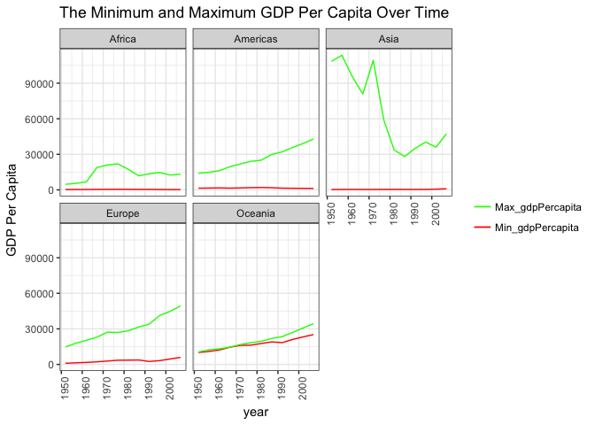
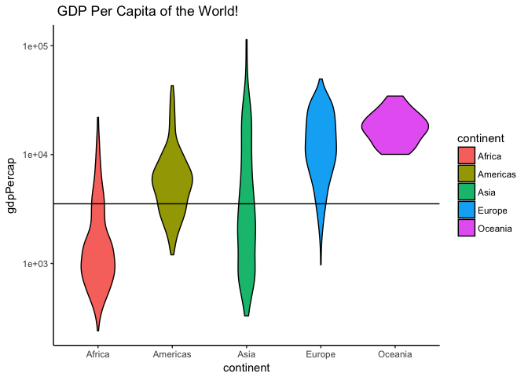
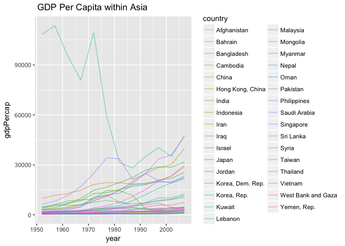
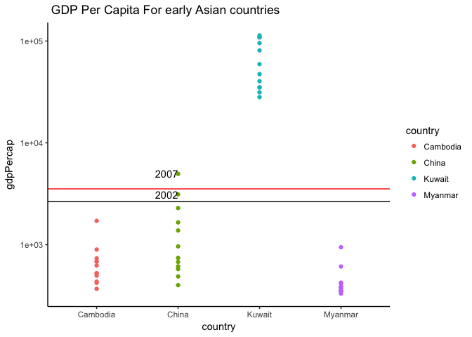
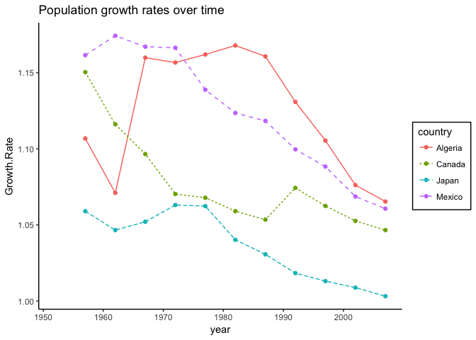
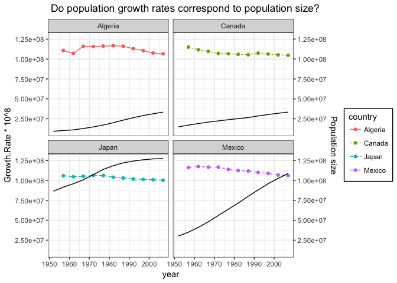

HW03\_GGPLOT2
================
Chad Fibke
2017-10-11

1.Installation of data set and data analysis packages
=====================================================

``` r
library(gapminder)
library(tidyverse)
```

    ## Loading tidyverse: ggplot2
    ## Loading tidyverse: tibble
    ## Loading tidyverse: tidyr
    ## Loading tidyverse: readr
    ## Loading tidyverse: purrr
    ## Loading tidyverse: dplyr

    ## Conflicts with tidy packages ----------------------------------------------

    ## filter(): dplyr, stats
    ## lag():    dplyr, stats

Ok, everything is ready to rock and roll.

Just a quick note, comments about my code will be at the bottom of code chunks:

``` r
# Like this 
```

and comments about my workflow will be outside of the code chunks.

2.Deep Data Dive
================

2.A "Get the maximum and minimum of GDP per capita for all continents"
----------------------------------------------------------------------

Lets get the values of these GDP per capitas for each continent over all the years.

``` r
Continent.range <- gapminder %>%
  group_by(continent, year) %>% 
  summarise(Min_gdpPercapita = min(gdpPercap), Max_gdpPercapita = max(gdpPercap)) 


knitr::kable(head(Continent.range))
```

| continent |  year|  Min\_gdpPercapita|  Max\_gdpPercapita|
|:----------|-----:|------------------:|------------------:|
| Africa    |  1952|           298.8462|           4725.296|
| Africa    |  1957|           335.9971|           5487.104|
| Africa    |  1962|           355.2032|           6757.031|
| Africa    |  1967|           412.9775|          18772.752|
| Africa    |  1972|           464.0995|          21011.497|
| Africa    |  1977|           502.3197|          21951.212|

The above table shows both the Min, and Max GDP/capita for every continent for every year.

So now lets plot this:

``` r
ggplot(Continent.range, aes(x = year))+
  geom_line(mapping = aes(y = Min_gdpPercapita, color = "Min_gdpPercapita"))+
   geom_line(mapping = aes( y = Max_gdpPercapita, color = "Max_gdpPercapita"))+
  scale_colour_manual( "", values = c("Min_gdpPercapita" = "red", "Max_gdpPercapita" = "green"))+
  facet_wrap(~continent)+
  theme_bw()+
   ggtitle("The Minimum and Maximum GDP Per Capita Over Time")+
   ylab("GDP Per Capita")+
   theme(axis.text.x = element_text(angle = 90))
```



``` r
# I first set an initial plot with an x variable, and then I layered on the min and max as separate y variables layers.
# I colored each layer by the corresponding Y variable then had to manually set the colors to create a ledged.
```

The scale\_colour\_manual trick was learned [here](https://stackoverflow.com/questions/10349206/add-legend-to-ggplot2-line-plot). The rotation of the x axis was learned [over here](https://stackoverflow.com/questions/1330989/rotating-and-spacing-axis-labels-in-ggplot2)

This plot shows us that:

-   Most of the continent's min GDP Per Capita do not increase over the years. Only the Oceania experiences a gradual increase in both Min/Max.
-   The max GDP Per Capita increases in most continents as the years progress.

-   Taken together, most continents have countries that are consistently performing poorly, and have some countries that are progressively preforming better.

2.B"Look at the spread of GDP per capita within the continents/Find countries with interesting stories."
--------------------------------------------------------------------------------------------------------

Lets look at a generic distribution of the GDP per capita in one go

``` r
ggplot(gapminder, aes( x = continent, y = gdpPercap))+
  geom_violin(aes(fill = continent), color = "black")+
  scale_y_log10()+
   theme_classic()+
   ggtitle(" GDP Per Capita of the World!")+
   geom_hline(aes(yintercept = median(gapminder$gdpPercap)))
```



``` r
# I added a black line to show the median gdp per capita of the whole world. This line will hopefully aid in comparing how each continent is performing.

# The above graph uses violin function, which is a Frankenstein of a box plot combined with a density curve. This plot shows us the distribution of every observation within each continent.
```

Lets try to figure out why Asia has such a large distribution. Is it that Asian countries started off doing poorly and worked there way up? (stay tuned):

``` r
Asian.GDP <- gapminder %>%
  select(continent, country, year, gdpPercap) %>%
  filter(continent == "Asia")

knitr::kable(head(Asian.GDP))
```

| continent | country     |  year|  gdpPercap|
|:----------|:------------|-----:|----------:|
| Asia      | Afghanistan |  1952|   779.4453|
| Asia      | Afghanistan |  1957|   820.8530|
| Asia      | Afghanistan |  1962|   853.1007|
| Asia      | Afghanistan |  1967|   836.1971|
| Asia      | Afghanistan |  1972|   739.9811|
| Asia      | Afghanistan |  1977|   786.1134|

``` r
Asian.GDP %>%  ggplot( aes( x = year, y = gdpPercap, group=country)) +
  geom_line(aes(color = country), alpha = 0.5)+
  ggtitle(" GDP Per Capita within Asia")
```



The table shows the GDP Per Capita values for all Asian countries. This messy plot shows some extreme outliers that are contributing to the massive spread within Asia.

I will now proceed by finding which countries are contributing to the large distribution by selecting the early years where these outliers are most prominent.

``` r
Asian.GDP %>%
  filter(gdpPercap > 90000  | gdpPercap < 500, year %in% 1950:1970) %>%
  select(country, year, gdpPercap) %>%
  arrange(country, gdpPercap) 
```

    ## # A tibble: 12 x 3
    ##     country  year   gdpPercap
    ##      <fctr> <int>       <dbl>
    ##  1 Cambodia  1952    368.4693
    ##  2 Cambodia  1957    434.0383
    ##  3 Cambodia  1962    496.9136
    ##  4    China  1952    400.4486
    ##  5    China  1962    487.6740
    ##  6   Kuwait  1962  95458.1118
    ##  7   Kuwait  1952 108382.3529
    ##  8   Kuwait  1957 113523.1329
    ##  9  Myanmar  1952    331.0000
    ## 10  Myanmar  1967    349.0000
    ## 11  Myanmar  1957    350.0000
    ## 12  Myanmar  1962    388.0000

``` r
# I looked for countries in early years with either an extremely high Gdp/capita, or a extremely low Gdp/capita.
```

This step was used to determine which countries are stretching the distribution. It shows that Cambodia, China, Myanmar, and Kuwait are extreme outliers!

Now I will select for all these influential country observations and plot them

``` r
Influential.Countries <- Asian.GDP %>%
  filter(country %in% c("Cambodia","China", "Kuwait", "Myanmar")) 

knitr::kable(Influential.Countries)
```

| continent | country  |  year|    gdpPercap|
|:----------|:---------|-----:|------------:|
| Asia      | Cambodia |  1952|     368.4693|
| Asia      | Cambodia |  1957|     434.0383|
| Asia      | Cambodia |  1962|     496.9136|
| Asia      | Cambodia |  1967|     523.4323|
| Asia      | Cambodia |  1972|     421.6240|
| Asia      | Cambodia |  1977|     524.9722|
| Asia      | Cambodia |  1982|     624.4755|
| Asia      | Cambodia |  1987|     683.8956|
| Asia      | Cambodia |  1992|     682.3032|
| Asia      | Cambodia |  1997|     734.2852|
| Asia      | Cambodia |  2002|     896.2260|
| Asia      | Cambodia |  2007|    1713.7787|
| Asia      | China    |  1952|     400.4486|
| Asia      | China    |  1957|     575.9870|
| Asia      | China    |  1962|     487.6740|
| Asia      | China    |  1967|     612.7057|
| Asia      | China    |  1972|     676.9001|
| Asia      | China    |  1977|     741.2375|
| Asia      | China    |  1982|     962.4214|
| Asia      | China    |  1987|    1378.9040|
| Asia      | China    |  1992|    1655.7842|
| Asia      | China    |  1997|    2289.2341|
| Asia      | China    |  2002|    3119.2809|
| Asia      | China    |  2007|    4959.1149|
| Asia      | Kuwait   |  1952|  108382.3529|
| Asia      | Kuwait   |  1957|  113523.1329|
| Asia      | Kuwait   |  1962|   95458.1118|
| Asia      | Kuwait   |  1967|   80894.8833|
| Asia      | Kuwait   |  1972|  109347.8670|
| Asia      | Kuwait   |  1977|   59265.4771|
| Asia      | Kuwait   |  1982|   31354.0357|
| Asia      | Kuwait   |  1987|   28118.4300|
| Asia      | Kuwait   |  1992|   34932.9196|
| Asia      | Kuwait   |  1997|   40300.6200|
| Asia      | Kuwait   |  2002|   35110.1057|
| Asia      | Kuwait   |  2007|   47306.9898|
| Asia      | Myanmar  |  1952|     331.0000|
| Asia      | Myanmar  |  1957|     350.0000|
| Asia      | Myanmar  |  1962|     388.0000|
| Asia      | Myanmar  |  1967|     349.0000|
| Asia      | Myanmar  |  1972|     357.0000|
| Asia      | Myanmar  |  1977|     371.0000|
| Asia      | Myanmar  |  1982|     424.0000|
| Asia      | Myanmar  |  1987|     385.0000|
| Asia      | Myanmar  |  1992|     347.0000|
| Asia      | Myanmar  |  1997|     415.0000|
| Asia      | Myanmar  |  2002|     611.0000|
| Asia      | Myanmar  |  2007|     944.0000|

``` r
median.value <- median(Asian.GDP$gdpPercap)

# This is the median for all Asian countries and will be plotted below 
  
  ggplot(Influential.Countries, aes(x = country, y = gdpPercap))+
  geom_point(aes(color = country))+
 geom_text(aes(label=ifelse(gdpPercap>median.value & gdpPercap < 10000 ,as.character(year),''),hjust=1))+
  geom_hline(aes(yintercept = median.value))+
 geom_hline(aes(yintercept = median(gapminder$gdpPercap)), color = "red")+
  scale_y_log10()+
  theme_classic()+
    ggtitle(" GDP Per Capita For early Asian countries")
```



``` r
# The red line is the median for the world GDP Per Capita (we saw this above).
# The black represents the median for all Asian counties. Both these lines are used to see how weird these counties are!
  
# I added a text label to years that were above the median for all Asian counties (black line), but were also in the "non-weird range".
```

This tables shows all the observations (over all years) for the outlier countries: Cambodia, China, Myanmar, and Kuwait.

The plot shows:

-   Cambodia and Myanmar are well below both the world median (red), and the Asian median (black) over all years data was collected.
-   China is below both the world median (red), and the Asian median (black) over most years. However, China does exceed both these medians in 2007!
-   Kuwait is well above both of these medians for the duration of the study! We actually see that Kuwait is the country that contributes to the MAX GDP Per Capita in 2.A.

All of these counties are the weirdos, except China, which becomes more typical over time!

2.C"Make up your own!"
----------------------

### I'm going to attepmt to see how population growth rate changes for some developed and developing countries!

Lets first wrangle some of the countries of interest so we aren’t overloaded with data

``` r
Selected.Countries <- gapminder %>%
  select(continent, country, year, pop) %>%
  filter(country %in% c("Canada", "Japan", "Mexico", "Algeria"))
```

Now that I have the selected countries I will calculate the population growth rate as a quotient. This quotient is calculated by (pop at time 1/ pop at time 0). If we get a quotient of 1.1 we have a 10% growth rate.

lets start by grouping and creating this quotient

``` r
Pop.Growth.Rate <- Selected.Countries %>%
  group_by(country) %>%
  arrange(country, year) %>%
  mutate(Lagged.pop = lag(pop, 1), Growth.Rate = pop /lag(pop, 1))

# I first group by country so the quotient would be calculated within each country, and I made sure the years were ordered properly 
# I then created the new growth rate by dividing the population vector by a lagged population vector. The table below demonstrates this division in a horizontal manor [ pop(t1) / legged pop(t0)]

knitr::kable(Pop.Growth.Rate)
```

| continent | country |  year|        pop|  Lagged.pop|  Growth.Rate|
|:----------|:--------|-----:|----------:|-----------:|------------:|
| Africa    | Algeria |  1952|    9279525|          NA|           NA|
| Africa    | Algeria |  1957|   10270856|     9279525|     1.106830|
| Africa    | Algeria |  1962|   11000948|    10270856|     1.071084|
| Africa    | Algeria |  1967|   12760499|    11000948|     1.159945|
| Africa    | Algeria |  1972|   14760787|    12760499|     1.156756|
| Africa    | Algeria |  1977|   17152804|    14760787|     1.162052|
| Africa    | Algeria |  1982|   20033753|    17152804|     1.167958|
| Africa    | Algeria |  1987|   23254956|    20033753|     1.160789|
| Africa    | Algeria |  1992|   26298373|    23254956|     1.130872|
| Africa    | Algeria |  1997|   29072015|    26298373|     1.105468|
| Africa    | Algeria |  2002|   31287142|    29072015|     1.076194|
| Africa    | Algeria |  2007|   33333216|    31287142|     1.065397|
| Americas  | Canada  |  1952|   14785584|          NA|           NA|
| Americas  | Canada  |  1957|   17010154|    14785584|     1.150455|
| Americas  | Canada  |  1962|   18985849|    17010154|     1.116148|
| Americas  | Canada  |  1967|   20819767|    18985849|     1.096594|
| Americas  | Canada  |  1972|   22284500|    20819767|     1.070353|
| Americas  | Canada  |  1977|   23796400|    22284500|     1.067845|
| Americas  | Canada  |  1982|   25201900|    23796400|     1.059064|
| Americas  | Canada  |  1987|   26549700|    25201900|     1.053480|
| Americas  | Canada  |  1992|   28523502|    26549700|     1.074344|
| Americas  | Canada  |  1997|   30305843|    28523502|     1.062487|
| Americas  | Canada  |  2002|   31902268|    30305843|     1.052677|
| Americas  | Canada  |  2007|   33390141|    31902268|     1.046639|
| Asia      | Japan   |  1952|   86459025|          NA|           NA|
| Asia      | Japan   |  1957|   91563009|    86459025|     1.059034|
| Asia      | Japan   |  1962|   95831757|    91563009|     1.046621|
| Asia      | Japan   |  1967|  100825279|    95831757|     1.052107|
| Asia      | Japan   |  1972|  107188273|   100825279|     1.063109|
| Asia      | Japan   |  1977|  113872473|   107188273|     1.062359|
| Asia      | Japan   |  1982|  118454974|   113872473|     1.040242|
| Asia      | Japan   |  1987|  122091325|   118454974|     1.030698|
| Asia      | Japan   |  1992|  124329269|   122091325|     1.018330|
| Asia      | Japan   |  1997|  125956499|   124329269|     1.013088|
| Asia      | Japan   |  2002|  127065841|   125956499|     1.008807|
| Asia      | Japan   |  2007|  127467972|   127065841|     1.003165|
| Americas  | Mexico  |  1952|   30144317|          NA|           NA|
| Americas  | Mexico  |  1957|   35015548|    30144317|     1.161597|
| Americas  | Mexico  |  1962|   41121485|    35015548|     1.174378|
| Americas  | Mexico  |  1967|   47995559|    41121485|     1.167165|
| Americas  | Mexico  |  1972|   55984294|    47995559|     1.166447|
| Americas  | Mexico  |  1977|   63759976|    55984294|     1.138890|
| Americas  | Mexico  |  1982|   71640904|    63759976|     1.123603|
| Americas  | Mexico  |  1987|   80122492|    71640904|     1.118390|
| Americas  | Mexico  |  1992|   88111030|    80122492|     1.099704|
| Americas  | Mexico  |  1997|   95895146|    88111030|     1.088344|
| Americas  | Mexico  |  2002|  102479927|    95895146|     1.068666|
| Americas  | Mexico  |  2007|  108700891|   102479927|     1.060704|

The table demonstrates the calculation of the quotient in a horizontal manor \[ pop(t1) / legged pop(t0)\], **AND** also shows us the growth rate for these countries over time!

``` r
ggplot(Pop.Growth.Rate, aes(x = year, y = Growth.Rate))+
  geom_path(aes( color = country, lty = country))+
  geom_point(aes(color = country))+
  theme_classic()+
   ggtitle("Population growth rates over time")+
  theme(legend.background = element_rect( linetype="solid",colour ="black"))
```

    ## Warning: Removed 4 rows containing missing values (geom_path).

    ## Warning: Removed 4 rows containing missing values (geom_point).



``` r
# It will remove 4 rows, which are the starting populations for each country
```

I went [here](http://www.sthda.com/english/wiki/ggplot2-legend-easy-steps-to-change-the-position-and-the-appearance-of-a-graph-legend-in-r-software) to figure out how to add a ledgend.

This plot tells us that:

-   That the more developed countries (Canada & Japan) have lower growth rates, which have been in a downward trend over the past ~60 years.
-   Mexico, a developing country, shows a lagged decline is growth rate. This means that the growth rates were high, and the decline occurred much later in time.
-   Algeria, a less developed country, shows a peak in growth rates in past years, which has also started to decline.
-   Together, these shared trends show that over time the population growth rate decreases.

Lets dig a little deeper and see if the absolute value of the population numbers resemble the growth rates.

``` r
ggplot(Pop.Growth.Rate, aes(x = year, y = Growth.Rate* 10^8))+
  geom_path(aes( color = country, lty = country))+
  geom_point(aes(color = country))+
  theme_bw()+
  ggtitle(" Do population growth rates correspond to population size? ")+
  theme(legend.background = element_rect( linetype="solid",colour ="black"))+
  facet_wrap(~country)+
  geom_line(aes(y = pop))+
  scale_y_continuous(sec.axis = sec_axis(~., name = "Population size"))
```

    ## Warning: Removed 4 rows containing missing values (geom_path).

    ## Warning: Removed 4 rows containing missing values (geom_point).



``` r
# I added a second y axis (on the right hand side) for the population variable. The population over the years for each continent is repersented by the black line.

# I had to multiply the rates by 10^8 so the lines would be comparable. 
```

I had problems scaling this graph! I could not set the y axis to see the natural units of both variables (to compare the growth rate to the actual population size). So to get around this I jerry-rigged the data so we could compare the trends.

-   The trends in both variables are not exactly what I expected. I wanted to show you guys that when populations get to a certain size we see the population growth rate slows! This idea is from the theory of demographic transition - when a country becomes more developed there is a peak in growth rates followed by a decline!
