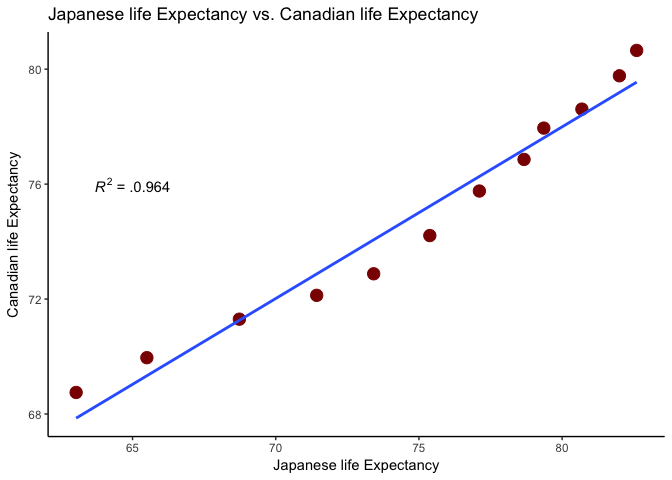
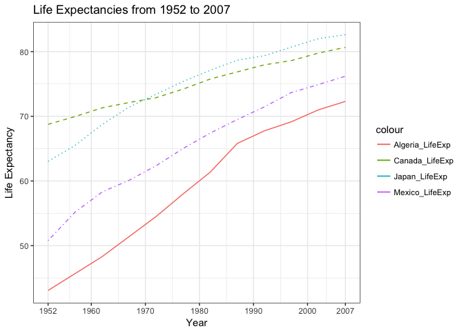

HW04
================
Chad Fibke
2017-10-04

1.Installation of data set and data analysis packages
=====================================================

``` r
library(gapminder)
library(tidyverse)
```

    ## Loading tidyverse: ggplot2
    ## Loading tidyverse: tibble
    ## Loading tidyverse: tidyr
    ## Loading tidyverse: readr
    ## Loading tidyverse: purrr
    ## Loading tidyverse: dplyr

    ## Conflicts with tidy packages ----------------------------------------------

    ## filter(): dplyr, stats
    ## lag():    dplyr, stats

Just a quick note, comments about my code will be:

``` r
# Like this 
```

and comments about my workflow will be outside of the code chunks.

2.General data reshaping and relationship to aggregation
========================================================

**Make a tibble with one row/year and columns for life expectancy for two or more countries (Activity \#2)**:

I will start by Selecting countries and variables of interest

``` r
Selected.Countries <- gapminder %>%
  select(country, year, lifeExp) %>%
  filter(country %in% c("Canada", "Japan", "Mexico", "Algeria")) 
```

Now lets use spread to spread out countries!

``` r
Wide.df <- Selected.Countries %>%
  spread(key = country, value = lifeExp) %>% 
  setNames(c("Year", "Algeria_LifeExp", "Canada_LifeExp", "Japan_LifeExp", "Mexico_LifeExp")) #SetNames allows you to customize the names of your columns after they have been reshaped.
knitr::kable(Wide.df)
```

|  Year|  Algeria\_LifeExp|  Canada\_LifeExp|  Japan\_LifeExp|  Mexico\_LifeExp|
|-----:|-----------------:|----------------:|---------------:|----------------:|
|  1952|            43.077|           68.750|          63.030|           50.789|
|  1957|            45.685|           69.960|          65.500|           55.190|
|  1962|            48.303|           71.300|          68.730|           58.299|
|  1967|            51.407|           72.130|          71.430|           60.110|
|  1972|            54.518|           72.880|          73.420|           62.361|
|  1977|            58.014|           74.210|          75.380|           65.032|
|  1982|            61.368|           75.760|          77.110|           67.405|
|  1987|            65.799|           76.860|          78.670|           69.498|
|  1992|            67.744|           77.950|          79.360|           71.455|
|  1997|            69.152|           78.610|          80.690|           73.670|
|  2002|            70.994|           79.770|          82.000|           74.902|
|  2007|            72.301|           80.653|          82.603|           76.195|

Now, Lets see how this data works in ggplot2

``` r
round(cor(Wide.df$Japan_LifeExp, Wide.df$Canada_LifeExp), 3)^2 # Calculated R-squared to add it to my plot later.
```

    ## [1] 0.964324

``` r
Wide.df %>% 
  ggplot(aes(x = Japan_LifeExp, y = Canada_LifeExp))+
  geom_point(color = "Darkred", size = 4)+
  geom_smooth(se = FALSE, method = "lm")+
  theme_classic()+
  ggtitle("Japanese life Expectancy vs. Canadian life Expectancy")+
  ylab("Canadian life Expectancy")+
  xlab("Japanese life Expectancy")+
   annotate("text", x = 65, y = 76, label = "paste(italic(R) ^ 2, \" = .0.964\")",parse = TRUE)
```



This reshaping has allowed us to extract information that can help find the correlation between 2 countries, which subverts the need for a lot of filtering.

Ok... but I want to see all my countries over time:

``` r
Wide.df %>% 
  ggplot(aes(x = Year))+
  geom_line(mapping = aes(y = Algeria_LifeExp, color = "Algeria_LifeExp"), lty=1)+
    geom_line(mapping = aes(y = Canada_LifeExp,color = "Canada_LifeExp"),lty=2)+
   geom_line(mapping = aes(y = Japan_LifeExp,color = "Japan_LifeExp"),lty=3)+
  geom_line(mapping = aes(y = Mexico_LifeExp,color = "Mexico_LifeExp"),lty=4)+
  theme_bw()+
  ggtitle("Life Expectancies from 1952 to 2007")+
  ylab ("Life Expectancy")+
  scale_x_continuous("Year",
                     breaks = c(1952,1960, 1970,1980,1990,2000,2007))
```



The above code shows that the shape of our data can either help (in long form), or make things more tedious (wide form) to plot in ggplot2! When the data is in a wide format we have to add each country as a separate layer because they are seen as separate variables.

3.Join, merge, look up
======================

**Create a second data frame,join with part of Gapminder using a dplyr join function, and make some observations about the process and results (Activity \#1)**:

Let's start with making a smaller version of gapminder:

``` r
small.gapminder <- gapminder %>% 
  select(continent, country, pop, year) %>% 
  filter(country %in% c("Germany", "China", "Algeria", "Myanmar", "Afghanistan", "Argentina"), year == 2007) %>% 
  arrange(country)
```

Now, lets make a second data set with 2 overlapping variables and some added information:

``` r
Second.DF <- data.frame(country = c("Canada", "Germany", "China", "Algeria", "Myanmar", "Afghanistan"),
                        Economy = c("Developed economy", "Developed economy", "Developing economy","Developing economy", "Least developed economy", "Least developed economy"  ),
                        HDI = c(0.920, 0.926, 0.738, 0.745, 0.556,0.479),
                        pop = c(33390141, 82400996, 1318683, 33333216, 47761980, 31889923)) %>% 
  as.tbl %>% 
  arrange(country)

# I have added a mistake to China's population size to see what happenns when I try to join by this later (and to remind myself that the accuracy of data entry is important!)

knitr::kable(small.gapminder)
```

| continent | country     |         pop|  year|
|:----------|:------------|-----------:|-----:|
| Asia      | Afghanistan |    31889923|  2007|
| Africa    | Algeria     |    33333216|  2007|
| Americas  | Argentina   |    40301927|  2007|
| Asia      | China       |  1318683096|  2007|
| Europe    | Germany     |    82400996|  2007|
| Asia      | Myanmar     |    47761980|  2007|

``` r
knitr::kable(Second.DF)
```

| country     | Economy                 |    HDI|       pop|
|:------------|:------------------------|------:|---------:|
| Afghanistan | Least developed economy |  0.479|  31889923|
| Algeria     | Developing economy      |  0.745|  33333216|
| Canada      | Developed economy       |  0.920|  33390141|
| China       | Developing economy      |  0.738|   1318683|
| Germany     | Developed economy       |  0.926|  82400996|
| Myanmar     | Least developed economy |  0.556|  47761980|

I have arranged both data frames so you can easily compare what is different between them:

-   The small.gapminder data frame has Argentina in the place of Canada.
-   The Second.DF has a different population size for China.

Now that we have 2 data frames lets join them in different ways:

### Inner\_join():

This function will return all the OBS in the small.gapminder that have a matching value in the Second.DF. This will also return all the varibles from both data frames.

``` r
inner_join(small.gapminder, Second.DF, by = "country") %>% 
  knitr::kable()
```

    ## Warning: Column `country` joining factors with different levels, coercing
    ## to character vector

| continent | country     |       pop.x|  year| Economy                 |    HDI|     pop.y|
|:----------|:------------|-----------:|-----:|:------------------------|------:|---------:|
| Asia      | Afghanistan |    31889923|  2007| Least developed economy |  0.479|  31889923|
| Africa    | Algeria     |    33333216|  2007| Developing economy      |  0.745|  33333216|
| Asia      | China       |  1318683096|  2007| Developing economy      |  0.738|   1318683|
| Europe    | Germany     |    82400996|  2007| Developed economy       |  0.926|  82400996|
| Asia      | Myanmar     |    47761980|  2007| Least developed economy |  0.556|  47761980|

-   We lose Canada and Argentina because they are unique countries in each data frame.
-   When we say match only by country, this function will look for the shared country name/value, and will return all the other variables from both tables. We get a pop.x (pop from the small.gapminder) and a pop.y (pop from Second.DF) because we haven’t specified to match by these columns, so inner\_join will return them as different variables.

Since our data has 2 overlapping variables ("country", "pop"), lets join the columns using both variables to remove the duplicate pop variable.

``` r
inner_join(small.gapminder, Second.DF, by = c("country", "pop")) %>%
    knitr::kable()
```

    ## Warning: Column `country` joining factors with different levels, coercing
    ## to character vector

| continent | country     |       pop|  year| Economy                 |    HDI|
|:----------|:------------|---------:|-----:|:------------------------|------:|
| Asia      | Afghanistan |  31889923|  2007| Least developed economy |  0.479|
| Africa    | Algeria     |  33333216|  2007| Developing economy      |  0.745|
| Europe    | Germany     |  82400996|  2007| Developed economy       |  0.926|
| Asia      | Myanmar     |  47761980|  2007| Least developed economy |  0.556|

-   We now have the additional loss of China (which is a country found in both data frames) because of the difference/mistake in population size between these 2 data frames.

### semi\_join():

This function will allow us to return all the OBS in the small.gapminder that have a matching value in the Second.DF **BUT** This will only keep the columns from small.gapminder.

``` r
semi_join(small.gapminder, Second.DF) %>% 
  knitr::kable()# The defualt settings for join by =  variables by common/shared names! This will do the work for us!
```

    ## Joining, by = c("country", "pop")

    ## Warning: Column `country` joining factors with different levels, coercing
    ## to character vector

| continent | country     |       pop|  year|
|:----------|:------------|---------:|-----:|
| Asia      | Afghanistan |  31889923|  2007|
| Africa    | Algeria     |  33333216|  2007|
| Europe    | Germany     |  82400996|  2007|
| Asia      | Myanmar     |  47761980|  2007|

-   We kept the small.gapminder dimentions, but have filtered to *shared* OBS using the Second.DF.

### left\_join():

Will return all rows from small.gapminder **AND** will add the information from Second.DF where there is a match!

``` r
left_join(small.gapminder, Second.DF, by = c("country", "pop")) %>% 
  knitr::kable()
```

    ## Warning: Column `country` joining factors with different levels, coercing
    ## to character vector

| continent | country     |         pop|  year| Economy                 |    HDI|
|:----------|:------------|-----------:|-----:|:------------------------|------:|
| Asia      | Afghanistan |    31889923|  2007| Least developed economy |  0.479|
| Africa    | Algeria     |    33333216|  2007| Developing economy      |  0.745|
| Americas  | Argentina   |    40301927|  2007| NA                      |     NA|
| Asia      | China       |  1318683096|  2007| NA                      |     NA|
| Europe    | Germany     |    82400996|  2007| Developed economy       |  0.926|
| Asia      | Myanmar     |    47761980|  2007| Least developed economy |  0.556|

-   We see all OBS from small.gapminder are kept, but now we have added economy status, and HDI values were possible.
-   We have no extra information on Argentina because the Second.DF does not have the information.
-   We have no extra information on China because the matching criteria/values were not identical for "pop". (That silly mistake is coming back to haunt us!)

This will fix that population mistake:

``` r
left_join(small.gapminder, Second.DF, by = "country") %>% 
  knitr::kable()
```

    ## Warning: Column `country` joining factors with different levels, coercing
    ## to character vector

| continent | country     |       pop.x|  year| Economy                 |    HDI|     pop.y|
|:----------|:------------|-----------:|-----:|:------------------------|------:|---------:|
| Asia      | Afghanistan |    31889923|  2007| Least developed economy |  0.479|  31889923|
| Africa    | Algeria     |    33333216|  2007| Developing economy      |  0.745|  33333216|
| Americas  | Argentina   |    40301927|  2007| NA                      |     NA|        NA|
| Asia      | China       |  1318683096|  2007| Developing economy      |  0.738|   1318683|
| Europe    | Germany     |    82400996|  2007| Developed economy       |  0.926|  82400996|
| Asia      | Myanmar     |    47761980|  2007| Least developed economy |  0.556|  47761980|

-   Now that we only say look at country we can add information based on this match alone!

### anti\_join():

will return all OBS in small.gapminder that do not have a matching value in Second.DF,**AND** will only return the variables from small.gapminder

``` r
anti_join(small.gapminder, Second.DF, by = "country") %>% 
  knitr::kable()
```

    ## Warning: Column `country` joining factors with different levels, coercing
    ## to character vector

| continent | country   |       pop|  year|
|:----------|:----------|---------:|-----:|
| Americas  | Argentina |  40301927|  2007|

-   As noted above, Argentina is only found in the small.gapminder data frame, which was not found in the Second.DF!

### full\_join():

This will return all rows and columns from both small.gapminder, **AND** Second.DF

``` r
full_join(small.gapminder, Second.DF, by = c("country", "pop")) %>% 
  knitr::kable()
```

    ## Warning: Column `country` joining factors with different levels, coercing
    ## to character vector

| continent | country     |         pop|  year| Economy                 |    HDI|
|:----------|:------------|-----------:|-----:|:------------------------|------:|
| Asia      | Afghanistan |    31889923|  2007| Least developed economy |  0.479|
| Africa    | Algeria     |    33333216|  2007| Developing economy      |  0.745|
| Americas  | Argentina   |    40301927|  2007| NA                      |     NA|
| Asia      | China       |  1318683096|  2007| NA                      |     NA|
| Europe    | Germany     |    82400996|  2007| Developed economy       |  0.926|
| Asia      | Myanmar     |    47761980|  2007| Least developed economy |  0.556|
| NA        | Canada      |    33390141|    NA| Developed economy       |  0.920|
| NA        | China       |     1318683|    NA| Developing economy      |  0.738|

-   Again, China has been separated into 2 OBS because the matching criteria were not met for both country and population size!

Hopefully this report has shown you to make sure your data entry is accurate!!
