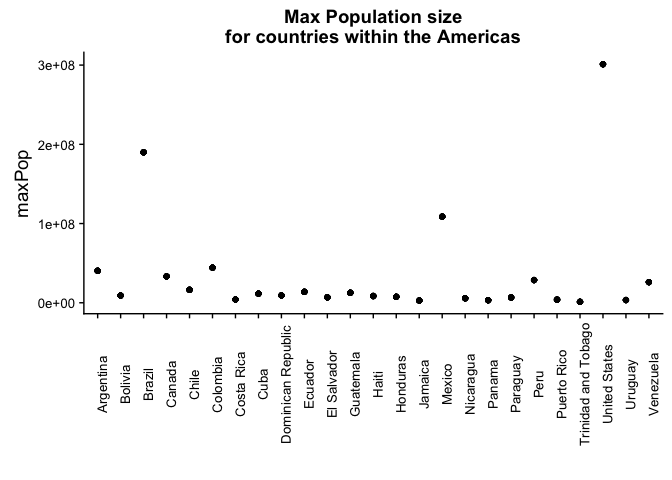
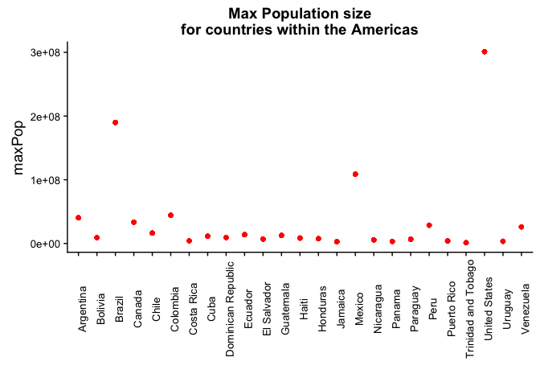
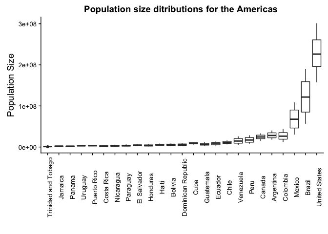
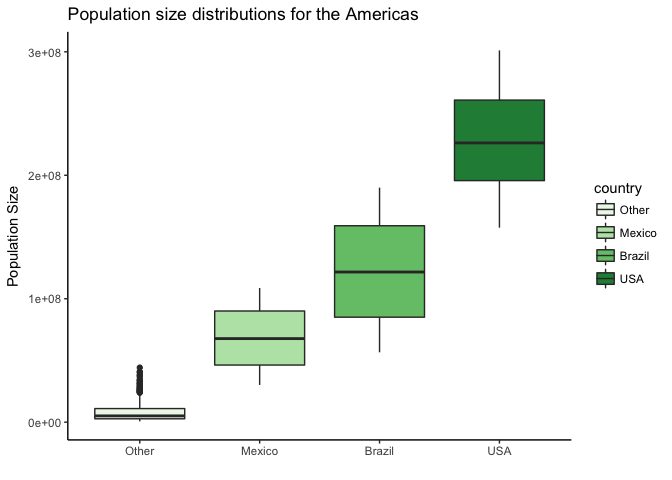
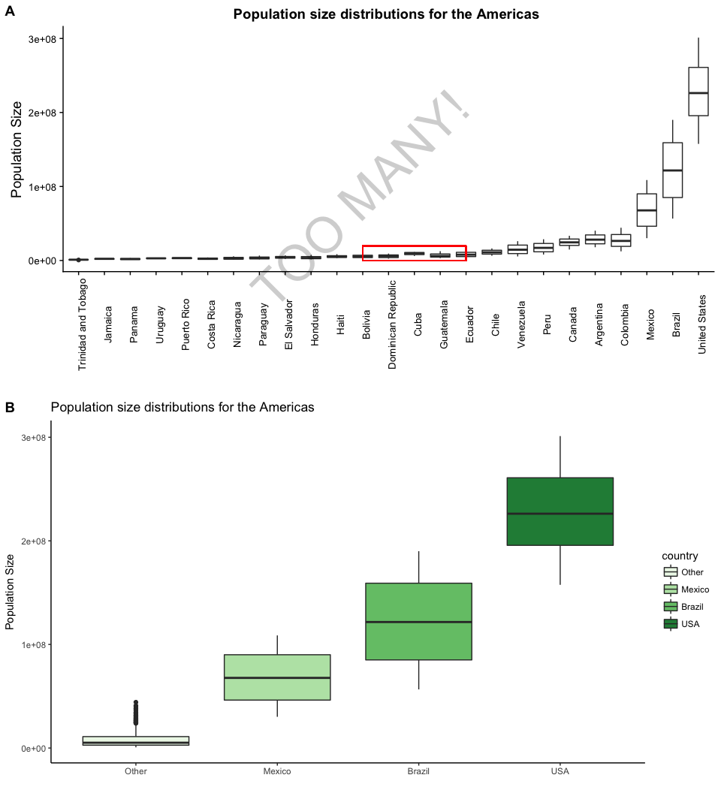
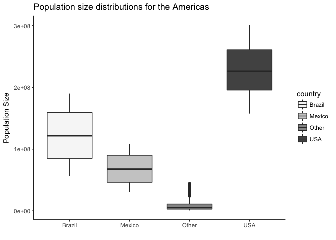
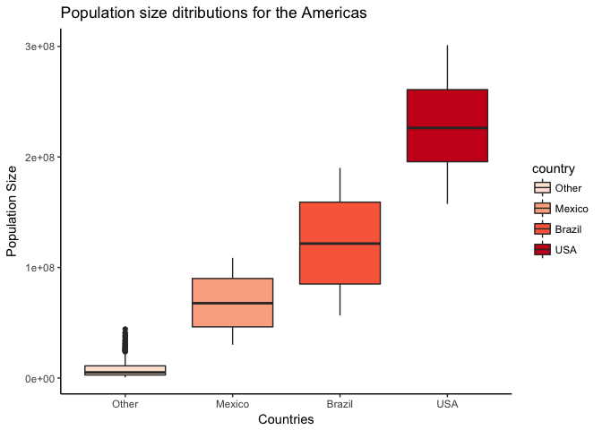

HW05\_THE\_FINISHER
================
Chad Fibke
2017-10-11

-   [1.Installation of data set and data analysis packages](#installation-of-data-set-and-data-analysis-packages)
-   [2.Factor management](#factor-management)
-   [3.Common part &File I/O](#common-part-file-io)
-   [4.Writing figures to file](#writing-figures-to-file)

1.Installation of data set and data analysis packages
=====================================================

``` r
library(gapminder)
library(tidyverse)
```

    ## Loading tidyverse: ggplot2
    ## Loading tidyverse: tibble
    ## Loading tidyverse: tidyr
    ## Loading tidyverse: readr
    ## Loading tidyverse: purrr
    ## Loading tidyverse: dplyr

    ## Conflicts with tidy packages ----------------------------------------------

    ## filter(): dplyr, stats
    ## lag():    dplyr, stats

``` r
library(forcats)
library(cowplot) #For plot manipulations
```

    ## 
    ## Attaching package: 'cowplot'

    ## The following object is masked from 'package:ggplot2':
    ## 
    ##     ggsave

``` r
library(RColorBrewer) # To add a little color to this party
```

Just some quick notes:

-   Comments about my code will be within code chunks:

``` r
# Like this 
```

-   Comments about my workflow will be outside of the code chunks.
-   I will be working with the gapminder dataset!

2.Factor management
===================

Let's take a look at gapminder to see what variables are considered factors:

``` r
str(gapminder)
```

    ## Classes 'tbl_df', 'tbl' and 'data.frame':    1704 obs. of  6 variables:
    ##  $ country  : Factor w/ 142 levels "Afghanistan",..: 1 1 1 1 1 1 1 1 1 1 ...
    ##  $ continent: Factor w/ 5 levels "Africa","Americas",..: 3 3 3 3 3 3 3 3 3 3 ...
    ##  $ year     : int  1952 1957 1962 1967 1972 1977 1982 1987 1992 1997 ...
    ##  $ lifeExp  : num  28.8 30.3 32 34 36.1 ...
    ##  $ pop      : int  8425333 9240934 10267083 11537966 13079460 14880372 12881816 13867957 16317921 22227415 ...
    ##  $ gdpPercap: num  779 821 853 836 740 ...

Now we know gapminder's variable:

-   Country is a factor and has 142 different levels.

``` r
levels(gapminder$country) %>% 
  head() %>% 
  knitr::kable(col.names = "Country Factors")# I'm only showing few levels to help our poor eyes
```

| Country Factors |
|:----------------|
| Afghanistan     |
| Albania         |
| Algeria         |
| Angola          |
| Argentina       |
| Australia       |

-   Continent is a factor and has 5 different levels.

``` r
levels(gapminder$continent) %>% 
  knitr::kable( col.names = "Continent Factors")
```

| Continent Factors |
|:------------------|
| Africa            |
| Americas          |
| Asia              |
| Europe            |
| Oceania           |

We now know what factors we are working with!

We want to drop Oceania, but **what** we are actually dropping:

``` r
 EX.Oceania <- gapminder %>% 
  filter(continent == "Oceania") 
 
EX.Oceania$country %>%   
   fct_drop() %>% 
  levels() 
```

    ## [1] "Australia"   "New Zealand"

``` r
EX.Oceania$continent %>%   
   fct_drop() %>% 
  nlevels() 
```

    ## [1] 1

The above shows that when we drop the Oceania:

-   One level will be dropped from continents.
-   Two levels will be dropped from countries.

Now we know how many we are dropping...... so I'm now going to drop them:

``` r
Dropped.Oceania <- gapminder %>% 
  filter(continent != "Oceania") %>% 
  droplevels()# droplevels was used because it can be applied to a dataset, whereas fct_drop  is applied to a vector. 

Dropped.Oceania$country %>%
  nlevels()# As seen above we have officially dropped the "Australia" and "New Zealand" levels, leaving us with 140 country levels.
```

    ## [1] 140

``` r
Dropped.Oceania$continent %>%
  levels()# As seen above we have officially dropped the Oceania level, leaving us with only 4 remaining continent levels.
```

    ## [1] "Africa"   "Americas" "Asia"     "Europe"

We have officially Dropped Oceania!

We can now wrangle this data so we can focus on the concept of reordering. Below, I isolate countries within the Americas:

``` r
THE.AMERICAS <- Dropped.Oceania %>%
  filter(continent == "Americas") %>% 
  select(continent, country, year, pop) %>%
  group_by(country) %>%
  mutate(maxPop = max(pop)) %>%
  ungroup() %>%  # We cannot reorder factors if the data frame is grouped.
  droplevels()
# this is just cleaning up some data to calculate the max population size in the Americas!
 


MaxPOP.Original<-THE.AMERICAS  %>%  
 ggplot(aes(x = country, y = maxPop))+
  geom_point()+
    ggtitle(" Max Population size \n for countries within the Americas ")+
  xlab("")+
    theme(axis.text.x = element_text(angle = 90),
          axis.text = element_text(size = 10)) # I'm assigning this plot because I'll be using it later.


MaxPOP.Original
```



We can see that the default alphabetically orders the countries.

What if we take the same data set and use arrange to move the countries around, and then see what happens when we plot it:

``` r
MaxPOP.Arranged <-THE.AMERICAS %>% 
  arrange(maxPop) 

knitr::kable(head(MaxPOP.Arranged))
```

| continent | country             |  year|      pop|   maxPop|
|:----------|:--------------------|-----:|--------:|--------:|
| Americas  | Trinidad and Tobago |  1952|   662850|  1191336|
| Americas  | Trinidad and Tobago |  1957|   764900|  1191336|
| Americas  | Trinidad and Tobago |  1962|   887498|  1191336|
| Americas  | Trinidad and Tobago |  1967|   960155|  1191336|
| Americas  | Trinidad and Tobago |  1972|   975199|  1191336|
| Americas  | Trinidad and Tobago |  1977|  1039009|  1191336|

``` r
#This is just to show that the data is arranged properly!


Arranged.plot <- MaxPOP.Arranged %>% 
  ggplot(aes(x = country, y = maxPop))+
  geom_point(color = "red")+
    ggtitle(" Max Population size \n for countries within the Americas ")+
  xlab("")+
    theme(axis.text.x = element_text(angle = 90),
          axis.text = element_text(size = 10))

Arranged.plot
```



Arranging the data, based on the max population size, does not have the ability to override the default alphabetical ordering when it comes to graphing. Arrange will only reorder the values within tables.

Now lets try to reorder these countries using forcats!:

``` r
Ordered.AMERICAS <- THE.AMERICAS %>% 
  mutate(country = fct_reorder(country, maxPop))


reordered.plot<- Ordered.AMERICAS%>%  
 ggplot(aes(x = country, y = pop))+
  geom_boxplot()+
     theme(axis.text.x = element_text(angle = 90),
             axis.text = element_text(size = 10))+
  ggtitle("Population size distributions for the Americas ")+
  xlab("")+
  ylab("Population Size")+
   geom_rect(aes(xmin = 12, xmax = 16, ymin = 1, ymax = 11^7), alpha = 0.0001, color = "red")

reordered.plot <- ggdraw(reordered.plot)  + 
  draw_label("TOO MANY!", angle = 45, size = 50, alpha = .2)
reordered.plot
```


I chose box plots because their upper whiskers are sensitive to large outlier (max population values). The red box shows this ordering is specific to the max observation **and** ignores medians. This plot also shows:

-   That reordering a factor, by another quantitative measure, can help order it within both tables, and plots!
-   Too Many refers to a lot of countries have similar populations distributions, which we will correct for later!

lets try to mess up the reordered data with arranging the data in descending order

``` r
Mixed<- Ordered.AMERICAS %>% 
  arrange(desc(maxPop)) 

Mixed%>%
  head() %>% 
  knitr::kable()
```

| continent | country       |  year|        pop|     maxPop|
|:----------|:--------------|-----:|----------:|----------:|
| Americas  | United States |  1952|  157553000|  301139947|
| Americas  | United States |  1957|  171984000|  301139947|
| Americas  | United States |  1962|  186538000|  301139947|
| Americas  | United States |  1967|  198712000|  301139947|
| Americas  | United States |  1972|  209896000|  301139947|
| Americas  | United States |  1977|  220239000|  301139947|

``` r
#This is just to show that the data is arranged properly!
  
  
  Mix.plot <- Mixed %>% 
ggplot(aes(x = country, y = pop))+
  geom_boxplot()+
     theme(axis.text.x = element_text(angle = 90),
             axis.text = element_text(size = 10))+
  ggtitle("Population size ditributions for the Americas ")+
  xlab("")+
  ylab("Population Size")
  
  
Mix.plot
```



This shows agian, that using arrange will only effect the ordering within a table, and cannot override the factor order within a plot.

I'm going to show the use of fct\_collapse to rename **AND** lump at the same time. As we saw above, a lot of countries have similar population distributions, so I'm going to call them "other":

``` r
Collapsed.Americas <- Ordered.AMERICAS %>% 
  mutate(country =fct_collapse (Ordered.AMERICAS$country, Other = c("Trinidad and Tobago", "Jamaica", "Panama", "Uruguay", "Puerto Rico", "Costa Rica", "Nicaragua", "Paraguay", "El Salvador", "Honduras", "Haiti", "Bolivia", "Dominican Republic", "Cuba", "Guatemala","Ecuador", "Chile", "Venezuela", "Peru", "Canada", "Argentina", "Colombia" ),
  Mexico ="Mexico",
  Brazil ="Brazil",
  USA = "United States")) %>% 
  droplevels()

 easy.to.read <- Collapsed.Americas %>% 
 ggplot(aes(x = country, y = pop))+  # I already re-ordered above!
  geom_boxplot(aes(fill = country))+
   theme_classic()+
  ggtitle("Population size distributions for the Americas ")+
  xlab("")+
  ylab("Population Size")+
   scale_fill_manual(values=brewer.pal(n=4, "Greens"))
  easy.to.read
```



The more green the more people!

Below, I’ve use cow plots to show the difference that fct\_collapse made by comparing 2 graphs:

``` r
plot_grid(reordered.plot, easy.to.read, labels = c("A", "B"), nrow = 2, align = "v")
```

    ## Warning in align_plots(plotlist = plots, align = align, axis = axis):
    ## Complex graphs cannot be vertically aligned unless axis parameter is set
    ## properly. Placing graphs unaligned.



3.Common part &File I/O
=======================

Lets continue our adventure with the Collapsed.Americas dataset, and make sure the factors have been managed properly before we start saving:

``` r
Collapsed.Americas$country %>%
  levels() %>% 
  knitr::kable( col.names = "Country Factors")# This is just to remind you what is in Collapsed.Americas
```

| Country Factors |
|:----------------|
| Other           |
| Mexico          |
| Brazil          |
| USA             |

We have finished some analysis for the day (what we have done above) and decide to save our data:

``` r
write_csv(Collapsed.Americas, "Collapsed.Americas.csv")
```

Boom, saved! We no longer have to worry about losing our data! (I cannot remove this dataset because Knitr has given me an error saying that this object doesn’t exist when I use it in later code)

I'm now going to load this Csv file and see if our factors are still safe:

``` r
Collapsed.Americas.CSV <- read_csv("Collapsed.Americas.csv")
```

    ## Parsed with column specification:
    ## cols(
    ##   continent = col_character(),
    ##   country = col_character(),
    ##   year = col_integer(),
    ##   pop = col_integer(),
    ##   maxPop = col_integer()
    ## )

``` r
head(Collapsed.Americas.CSV)# I did not use kable to show the table because I wanted to show you the variable types  
```

    ## # A tibble: 6 x 5
    ##   continent country  year      pop   maxPop
    ##       <chr>   <chr> <int>    <int>    <int>
    ## 1  Americas   Other  1952 17876956 40301927
    ## 2  Americas   Other  1957 19610538 40301927
    ## 3  Americas   Other  1962 21283783 40301927
    ## 4  Americas   Other  1967 22934225 40301927
    ## 5  Americas   Other  1972 24779799 40301927
    ## 6  Americas   Other  1977 26983828 40301927

wait a second..... all my factor variables are seen as charactor variables. Let me fix that and continue to see if our variables are still ordered:

``` r
Collapsed.Americas.CSV %>% 
  mutate(country = factor(country), continent = factor(continent)) %>% 
  head() %>% 
  knitr::kable()
```

| continent | country |  year|       pop|    maxPop|
|:----------|:--------|-----:|---------:|---------:|
| Americas  | Other   |  1952|  17876956|  40301927|
| Americas  | Other   |  1957|  19610538|  40301927|
| Americas  | Other   |  1962|  21283783|  40301927|
| Americas  | Other   |  1967|  22934225|  40301927|
| Americas  | Other   |  1972|  24779799|  40301927|
| Americas  | Other   |  1977|  26983828|  40301927|

``` r
 Collapsed.Americas.CSV %>%  
 ggplot(aes(x =country, y = pop))+
  geom_boxplot(aes(fill = country))+
   theme_classic()+
  ggtitle("Population size distributions for the Americas ")+
  xlab("")+
  ylab("Population Size")+
   scale_fill_manual(values=brewer.pal(n=4, "Greys"))
```



The above plot shows how "boring" using the write\_csv()/read\_csv() is because:

-   The factor names were kept, but this is also one of the strengths of fct\_collapse.
-   The factor order, based of max population size, was **not** kept!

OR we can import/export using dput/dget instead!

``` r
dput(Collapsed.Americas, "Collapsed.Americas-dput.txt")

Collapsed.Americas_dget <- dget("Collapsed.Americas-dput.txt") 


Collapsed.Americas_dget %>%
  head() %>% 
  knitr::kable()
```

| continent | country |  year|       pop|    maxPop|
|:----------|:--------|-----:|---------:|---------:|
| Americas  | Other   |  1952|  17876956|  40301927|
| Americas  | Other   |  1957|  19610538|  40301927|
| Americas  | Other   |  1962|  21283783|  40301927|
| Americas  | Other   |  1967|  22934225|  40301927|
| Americas  | Other   |  1972|  24779799|  40301927|
| Americas  | Other   |  1977|  26983828|  40301927|

``` r
Redhot <- Collapsed.Americas_dget %>% 
  ggplot(aes(x =country, y = pop))+
  geom_boxplot(aes(fill = country))+
   theme_classic()+
  ggtitle("Population size ditributions for the Americas ")+
  xlab("Countries")+
  ylab("Population Size")+
   scale_fill_manual(values=brewer.pal(n=4, "Reds"))

Redhot
```



The above plot shows how "red hot" using dput/dget is because:

-   The factor names were kept (due to fct\_collapse)
-   The factor order, based of max population size, was also kept!

4.Writing figures to file
=========================

I'm going to save the "red hot" boxplot from above:

``` r
ggsave(filename="Redhot.pdf", width = 8, height = 8, units = "cm", device = "pdf") #will save the above graph!
```

If we do not explicitly give the plot object name ggsave will save the most recent plot! If I wanted an older plot I'd have to specify the name:

``` r
ggsave(filename="other.pdf", plot = easy.to.read, width = 8, height = 8, units = "cm", device = "pdf")
```

And finally I'll attach it below:


This is weird because when I knitr the above I get the photo with the option to download it, but in Github it only has this as a link to the pdf. I think this is occurring because I'm using the output: "github\_document"!
