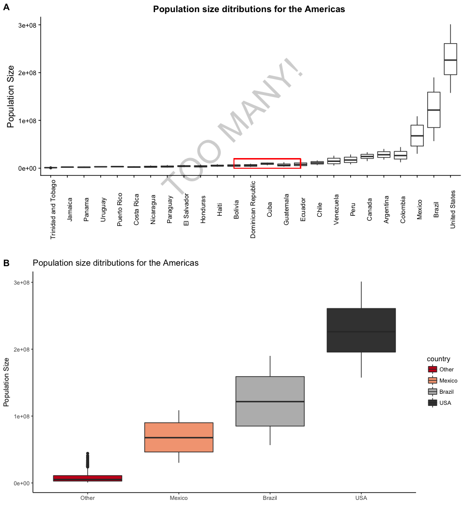

HW05\_THE\_FINISHER
================
Chad Fibke
2017-10-11

1.Installation of data set and data analysis packages
=====================================================

``` r
library(gapminder)
library(tidyverse)
```

    ## Loading tidyverse: ggplot2
    ## Loading tidyverse: tibble
    ## Loading tidyverse: tidyr
    ## Loading tidyverse: readr
    ## Loading tidyverse: purrr
    ## Loading tidyverse: dplyr

    ## Conflicts with tidy packages ----------------------------------------------

    ## filter(): dplyr, stats
    ## lag():    dplyr, stats

``` r
library(forcats)
```

Just some quick notes:

-   Comments about my code will be within code chunks:

``` r
# Like this 
```

-   Comments about my workflow will be outside of the code chunks.
-   I will be working with the gapminder dataset!

2.Factor management
===================

Let's take a look at gapminder to see what variables are considered factors:

``` r
str(gapminder)
```

    ## Classes 'tbl_df', 'tbl' and 'data.frame':    1704 obs. of  6 variables:
    ##  $ country  : Factor w/ 142 levels "Afghanistan",..: 1 1 1 1 1 1 1 1 1 1 ...
    ##  $ continent: Factor w/ 5 levels "Africa","Americas",..: 3 3 3 3 3 3 3 3 3 3 ...
    ##  $ year     : int  1952 1957 1962 1967 1972 1977 1982 1987 1992 1997 ...
    ##  $ lifeExp  : num  28.8 30.3 32 34 36.1 ...
    ##  $ pop      : int  8425333 9240934 10267083 11537966 13079460 14880372 12881816 13867957 16317921 22227415 ...
    ##  $ gdpPercap: num  779 821 853 836 740 ...

Now we know gapminder's variable:

-   Country is a factor and has 142 different levels.

``` r
levels(gapminder$country) %>% 
  head() %>% 
  knitr::kable(col.names = "Country Factors")# I'm only showing few levels to help our poor eyes
```

| Country Factors |
|:----------------|
| Afghanistan     |
| Albania         |
| Algeria         |
| Angola          |
| Argentina       |
| Australia       |

-   Continent is a factor and has 5 different levels.

``` r
levels(gapminder$continent) %>% 
  knitr::kable( col.names = "Continent Factors")
```

| Continent Factors |
|:------------------|
| Africa            |
| Americas          |
| Asia              |
| Europe            |
| Oceania           |

We now know what factors we are working with, so see what we have to drop! We want to drop Oceania, but lets see what we are actually dropping:

``` r
 EX.Oceania <- gapminder %>% 
  filter(continent == "Oceania") 
 

EX.Oceania$country %>%   
   fct_drop() %>% 
  levels() 
```

    ## [1] "Australia"   "New Zealand"

``` r
EX.Oceania$continent %>%   
   fct_drop() %>% 
  nlevels() 
```

    ## [1] 1

The above shows that when we drop the Oceania Continent:

-   One level will be dropped for continents.
-   Two levels will be dropped for countries.

Now we know how many we are dropping lets go in the reverse direction and drop them:

``` r
Without.Oceania <- gapminder %>% 
  filter(continent != "Oceania")

Dropped.Oceania  <- Without.Oceania %>%   
   droplevels()# droplevels was used because it can be applied to a dataset, whereas fct_drop  is applied to a vector. 

Dropped.Oceania$country %>%
  nlevels()# As seen above we have ofically droped the "Australia" and "New Zealand" levels, leaving us with 140 country levels.
```

    ## [1] 140

``` r
Dropped.Oceania$continent %>%
  levels()# As seen above we have officially dropped the Oceania level, leaving us with only 4 remaining continent levels.
```

    ## [1] "Africa"   "Americas" "Asia"     "Europe"

We now have the Dropped.Oceania dataset with factors that are of interest.

Let use this dataset to reorder the country factor based on the highest population size for the Americas:

``` r
POP.Growth <- Dropped.Oceania %>%
  filter(continent == "Americas") %>% 
  select(continent, country, year, pop) %>%
  group_by(country) %>%
  mutate(maxPop = max(pop))# this is just cleaning up some data to calculate the max population size per continent
 POP.Growth %>%  
 ggplot(aes(x = country, y = maxPop))+
  geom_point()+
    ggtitle(" Max Population size \n for countries within the Americas ")+
    theme(axis.text.x = element_text(angle = 90))
```


This graph makes our eyes work way to hard. Lets try reordering the factors based on max population size!

``` r
 POP.Growth %>%  
 ggplot(aes(x = fct_reorder(country, maxPop), y = pop))+
  geom_boxplot()+
     theme(axis.text.x = element_text(angle = 90))+
  ggtitle("Population size ditributions for the Americas ")+
  xlab("Countries")+
  ylab("Population Size")+
   geom_rect(aes(xmin = 12, xmax = 16, ymin = 1, ymax = 11^7), alpha = 0.0001, color = "red")
```


I chose box plots because their upper whiskers are sensitive to large outlier (max population values). The red box shows this ordering is not overridden when working with ggplots!

3.Common part &File I/O
=======================

Lets continue our adventure with the Dropped.Oceania dataset. From the above graphs we see that a lot of countries in the Americas have similar distributions and take up a lot of unnecessary space. Lets now consider lumping these countries and then export and import the results.

We should be dealing with 140 country levels because we dropped the Oceania levels and only wrangled the data, but lets find out:

``` r
POP.Growth$country %>% 
  nlevels()
```

    ## [1] 140

I'm now going to drop the other unused levels:

``` r
THE.AMERICAS <- POP.Growth %>% 
  droplevels()

THE.AMERICAS$continent %>% 
  levels()
```

    ## [1] "Americas"

``` r
THE.AMERICAS$country %>% 
  levels()
```

    ##  [1] "Argentina"           "Bolivia"             "Brazil"             
    ##  [4] "Canada"              "Chile"               "Colombia"           
    ##  [7] "Costa Rica"          "Cuba"                "Dominican Republic" 
    ## [10] "Ecuador"             "El Salvador"         "Guatemala"          
    ## [13] "Haiti"               "Honduras"            "Jamaica"            
    ## [16] "Mexico"              "Nicaragua"           "Panama"             
    ## [19] "Paraguay"            "Peru"                "Puerto Rico"        
    ## [22] "Trinidad and Tobago" "United States"       "Uruguay"            
    ## [25] "Venezuela"

Lets collapse **AND** reorder the countries into factors that we care about:

``` r
THE.AMERICAS<-ungroup(THE.AMERICAS)# We cannot reoder factors if the dataframe is grouped.

THE.AMERICAS <- THE.AMERICAS %>% 
  mutate(country = fct_reorder(country, maxPop))

            
Collapsed.Americas <- THE.AMERICAS %>% 
  mutate(country =fct_collapse (THE.AMERICAS$country, Non_interesting_Countries = c("Trinidad and Tobago", "Jamaica", "Panama", "Uruguay", "Puerto Rico", "Costa Rica", "Nicaragua", "Paraguay", "El Salvador", "Honduras", "Haiti", "Bolivia", "Dominican Republic", "Cuba", "Guatemala","Ecuador", "Chile", "Venezuela", "Peru", "Canada", "Argentina", "Colombia" ),
  Mexico ="Mexico",
  Brazil ="Brazil",
  USA = "United States")) %>% 
  droplevels()

Collapsed.Americas$country %>%
  levels()
```

    ## [1] "Non_interesting_Countries" "Mexico"                   
    ## [3] "Brazil"                    "USA"

``` r
 Collapsed.Americas %>% 
 ggplot(aes(x = fct_reorder(country, maxPop), y = pop))+
  geom_boxplot(aes(fill = country))+
   theme_classic()+
  ggtitle("Population size ditributions for the Americas ")+
  xlab("Countries")+
  ylab("Population Size")
```



We have finished some analysis for the day and decide the save our data.

``` r
write_csv(Collapsed.Americas, "Collapsed.Americas.csv")
```

Boom, saved! We no longer have to worry about losing our data! (I cannot remove this dataset because Knitr has given me an error say that this object doesnt exist when I use it in later code)

I'm now going to load this Csv file and see if our factors are still safe:

``` r
Collapsed.Americas.CSV <- read_csv("Collapsed.Americas.csv")
```

    ## Parsed with column specification:
    ## cols(
    ##   continent = col_character(),
    ##   country = col_character(),
    ##   year = col_integer(),
    ##   pop = col_integer(),
    ##   maxPop = col_integer()
    ## )

``` r
head(Collapsed.Americas.CSV)
```

    ## # A tibble: 6 x 5
    ##   continent                   country  year      pop   maxPop
    ##       <chr>                     <chr> <int>    <int>    <int>
    ## 1  Americas Non_interesting_Countries  1952 17876956 40301927
    ## 2  Americas Non_interesting_Countries  1957 19610538 40301927
    ## 3  Americas Non_interesting_Countries  1962 21283783 40301927
    ## 4  Americas Non_interesting_Countries  1967 22934225 40301927
    ## 5  Americas Non_interesting_Countries  1972 24779799 40301927
    ## 6  Americas Non_interesting_Countries  1977 26983828 40301927

wait a second..... all my factor variables are seen as charactor variables. Let me fix that and continue so see if my variables are still ordered:
==================================================================================================================================================

``` r
Collapsed.Americas.CSV %>% 
  mutate(country = factor(country), continent = factor(continent))
```

    ## # A tibble: 300 x 5
    ##    continent                   country  year      pop   maxPop
    ##       <fctr>                    <fctr> <int>    <int>    <int>
    ##  1  Americas Non_interesting_Countries  1952 17876956 40301927
    ##  2  Americas Non_interesting_Countries  1957 19610538 40301927
    ##  3  Americas Non_interesting_Countries  1962 21283783 40301927
    ##  4  Americas Non_interesting_Countries  1967 22934225 40301927
    ##  5  Americas Non_interesting_Countries  1972 24779799 40301927
    ##  6  Americas Non_interesting_Countries  1977 26983828 40301927
    ##  7  Americas Non_interesting_Countries  1982 29341374 40301927
    ##  8  Americas Non_interesting_Countries  1987 31620918 40301927
    ##  9  Americas Non_interesting_Countries  1992 33958947 40301927
    ## 10  Americas Non_interesting_Countries  1997 36203463 40301927
    ## # ... with 290 more rows

``` r
 Collapsed.Americas.CSV %>%  
 ggplot(aes(x =country, y = pop))+
  geom_boxplot()+
   theme_classic()+
  ggtitle("Population size ditributions for the Americas ")+
  xlab("Countries")+
  ylab("Population Size")
```

 For pet sakes all that hard work ordering these factors and now I have to repeate the prosess all over?!?!


``` r
dput(Collapsed.Americas, "Collapsed.Americas-dput.txt")
```

``` r
rm(Collapsed.Americas)
Collapsed.Americas_dget <- dget("Collapsed.Americas-dput.txt")
```
