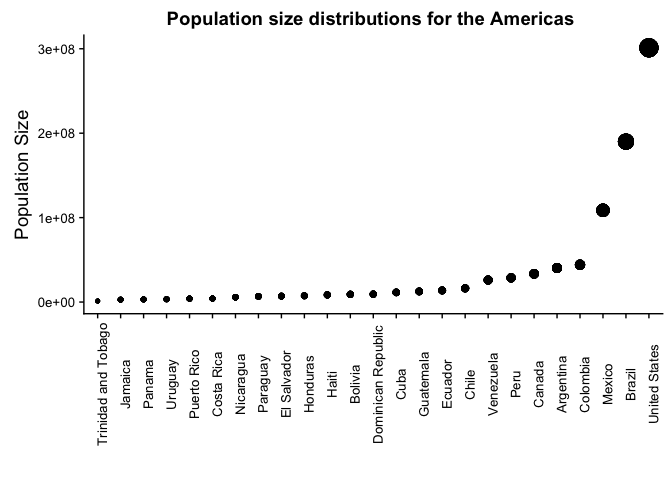
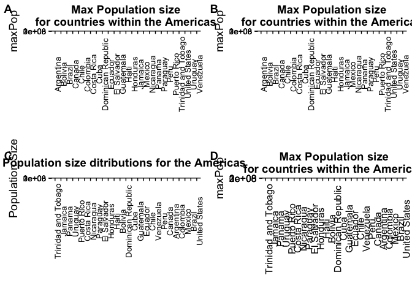

HW05\_THE\_FINISHER
================
Chad Fibke
2017-10-11

1.Installation of data set and data analysis packages
=====================================================

``` r
library(gapminder)
library(tidyverse)
```

    ## Loading tidyverse: ggplot2
    ## Loading tidyverse: tibble
    ## Loading tidyverse: tidyr
    ## Loading tidyverse: readr
    ## Loading tidyverse: purrr
    ## Loading tidyverse: dplyr

    ## Conflicts with tidy packages ----------------------------------------------

    ## filter(): dplyr, stats
    ## lag():    dplyr, stats

``` r
library(forcats)
library(cowplot) #For plot manipulations
```

    ## 
    ## Attaching package: 'cowplot'

    ## The following object is masked from 'package:ggplot2':
    ## 
    ##     ggsave

``` r
library(RColorBrewer) # To add a little color to this party
```

Just some quick notes:

-   Comments about my code will be within code chunks:

``` r
# Like this 
```

-   Comments about my workflow will be outside of the code chunks.
-   I will be working with the gapminder dataset!

2.Factor management
===================

Let's take a look at gapminder to see what variables are considered factors:

``` r
str(gapminder)
```

    ## Classes 'tbl_df', 'tbl' and 'data.frame':    1704 obs. of  6 variables:
    ##  $ country  : Factor w/ 142 levels "Afghanistan",..: 1 1 1 1 1 1 1 1 1 1 ...
    ##  $ continent: Factor w/ 5 levels "Africa","Americas",..: 3 3 3 3 3 3 3 3 3 3 ...
    ##  $ year     : int  1952 1957 1962 1967 1972 1977 1982 1987 1992 1997 ...
    ##  $ lifeExp  : num  28.8 30.3 32 34 36.1 ...
    ##  $ pop      : int  8425333 9240934 10267083 11537966 13079460 14880372 12881816 13867957 16317921 22227415 ...
    ##  $ gdpPercap: num  779 821 853 836 740 ...

Now we know gapminder's variable:

-   Country is a factor and has 142 different levels.

``` r
levels(gapminder$country) %>% 
  head() %>% 
  knitr::kable(col.names = "Country Factors")# I'm only showing few levels to help our poor eyes
```

| Country Factors |
|:----------------|
| Afghanistan     |
| Albania         |
| Algeria         |
| Angola          |
| Argentina       |
| Australia       |

-   Continent is a factor and has 5 different levels.

``` r
levels(gapminder$continent) %>% 
  knitr::kable( col.names = "Continent Factors")
```

| Continent Factors |
|:------------------|
| Africa            |
| Americas          |
| Asia              |
| Europe            |
| Oceania           |

We now know what factors we are working with!

We want to drop Oceania, but **what** we are actually dropping:

``` r
 EX.Oceania <- gapminder %>% 
  filter(continent == "Oceania") 
 
EX.Oceania$country %>%   
   fct_drop() %>% 
  levels() 
```

    ## [1] "Australia"   "New Zealand"

``` r
EX.Oceania$continent %>%   
   fct_drop() %>% 
  nlevels() 
```

    ## [1] 1

The above shows that when we drop the Oceania Continent:

-   One level will be dropped from continents.
-   Two levels will be dropped from countries.

Now we know how many we are dropping...... so I'm now going to drop them:

``` r
Dropped.Oceania <- gapminder %>% 
  filter(continent != "Oceania") %>% 
  droplevels()# droplevels was used because it can be applied to a dataset, whereas fct_drop  is applied to a vector. 

Dropped.Oceania$country %>%
  nlevels()# As seen above we have ofically droped the "Australia" and "New Zealand" levels, leaving us with 140 country levels.
```

    ## [1] 140

``` r
Dropped.Oceania$continent %>%
  levels()# As seen above we have officially dropped the Oceania level, leaving us with only 4 remaining continent levels.
```

    ## [1] "Africa"   "Americas" "Asia"     "Europe"

We have officially Dropped Oceania!

We can now wrangle this data so we can focus on the concept of reordering:

``` r
THE.AMERICAS <- Dropped.Oceania %>%
  filter(continent == "Americas") %>% 
  select(continent, country, year, pop) %>%
  group_by(country) %>%
  mutate(maxPop = max(pop)) %>%
  ungroup() %>%  # We cannot reoder factors if the dataframe is grouped.
  droplevels()
# this is just cleaning up some data to calculate the max population size in the Americas!
 


MaxPOP.Original<-THE.AMERICAS  %>%  
 ggplot(aes(x = country, y = maxPop))+
  geom_point()+
    ggtitle(" Max Population size \n for countries within the Americas ")+
  xlab("")+
    theme(axis.text.x = element_text(angle = 90),
          axis.text = element_text(size = 10)) # I'm assigning this plot because I'll be using it later.


MaxPOP.Original
```


We can see that the defualt alphabeticly orders the countries.

What if we take the same data set and use arrange to move the countries around? First, we can try the fct-reorder function to order the country factors based of Max Population, and see what happens when we plot it:

``` r
Ordered.AMERICAS <- THE.AMERICAS %>% 
  mutate(country = fct_reorder(country, maxPop))


reordered.plot<- Ordered.AMERICAS%>%  
 ggplot(aes(x = country, y = pop))+
  geom_boxplot()+
     theme(axis.text.x = element_text(angle = 90),
             axis.text = element_text(size = 10))+
  ggtitle("Population size ditributions for the Americas ")+
  xlab("")+
  ylab("Population Size")+
   geom_rect(aes(xmin = 12, xmax = 16, ymin = 1, ymax = 11^7), alpha = 0.0001, color = "red")

reordered.plot <- ggdraw(reordered.plot)  + 
  draw_label("TOO MANY!", angle = 45, size = 50, alpha = .2)
reordered.plot
```

 I chose box plots because their upper whiskers are sensitive to large outlier (max population values). The red box shows this ordering is specific to the max observation **and** ignors medians. This plot also shows:

-   That reordering a factor, by another quantitative messure, can help order it within a table or plot!

Before We move on to arrange I'm going to us fct\_collapse to rename **AND** lump at the same time. As we saw above, a lot of countries have similar population distributions, so I'm going to call them "other":

``` r
Collapsed.Americas <- Ordered.AMERICAS %>% 
  mutate(country =fct_collapse (Ordered.AMERICAS$country, Other = c("Trinidad and Tobago", "Jamaica", "Panama", "Uruguay", "Puerto Rico", "Costa Rica", "Nicaragua", "Paraguay", "El Salvador", "Honduras", "Haiti", "Bolivia", "Dominican Republic", "Cuba", "Guatemala","Ecuador", "Chile", "Venezuela", "Peru", "Canada", "Argentina", "Colombia" ),
  Mexico ="Mexico",
  Brazil ="Brazil",
  USA = "United States")) %>% 
  droplevels()

 easy.to.read <- Collapsed.Americas %>% 
 ggplot(aes(x = country, y = pop))+  # I already re-ordered above!
  geom_boxplot(aes(fill = country))+
   theme_classic()+
  ggtitle("Population size ditributions for the Americas ")+
  xlab("")+
  ylab("Population Size")+
   scale_fill_manual(values=brewer.pal(n=4, "RdGy"))
  easy.to.read
```



Below I'v use cow plots to compare the 2 graphs:

``` r
plot_grid(reordered.plot, easy.to.read, labels = c("A", "B"), nrow = 2, align = "v")
```

    ## Warning in align_plots(plotlist = plots, align = align, axis = axis):
    ## Complex graphs cannot be vertically aligned unless axis parameter is set
    ## properly. Placing graphs unaligned.


``` r
MaxPOP.Arranged <-THE.AMERICAS %>% 
  arrange(maxPop) 

knitr::kable(head(MaxPOP.Arranged))
```

| continent | country             |  year|      pop|   maxPop|
|:----------|:--------------------|-----:|--------:|--------:|
| Americas  | Trinidad and Tobago |  1952|   662850|  1191336|
| Americas  | Trinidad and Tobago |  1957|   764900|  1191336|
| Americas  | Trinidad and Tobago |  1962|   887498|  1191336|
| Americas  | Trinidad and Tobago |  1967|   960155|  1191336|
| Americas  | Trinidad and Tobago |  1972|   975199|  1191336|
| Americas  | Trinidad and Tobago |  1977|  1039009|  1191336|

``` r
#This is just to show that the data is arranged properly!


Arranged.plot <- MaxPOP.Arranged %>% 
  ggplot(aes(x = country, y = maxPop))+
  geom_point(color = "red")+
    ggtitle(" Max Population size \n for countries within the Americas ")+
  xlab("")+
    theme(axis.text.x = element_text(angle = 90),
          axis.text = element_text(size = 10))

Arranged.plot
```


Arranging the data, based on the max population size, does not have the ability to override the defult alphabetical ordering when it comes to graphing.

Now lets try to reorder these countries using forcats!

``` r
THE.AMERICAS <- THE.AMERICAS %>% 
  mutate(country = fct_reorder(country, maxPop))


reordered.plot<- THE.AMERICAS%>%  
 ggplot(aes(x = country, y = pop))+
  geom_boxplot()+
     theme(axis.text.x = element_text(angle = 90),
             axis.text = element_text(size = 10))+
  ggtitle("Population size ditributions for the Americas ")+
  xlab("")+
  ylab("Population Size")+
   geom_rect(aes(xmin = 12, xmax = 16, ymin = 1, ymax = 11^7), alpha = 0.0001, color = "red")

reordered.plot
```

 I chose box plots because their upper whiskers are sensitive to large outlier (max population values). The red box shows this ordering is specific to the max observation **and** ignors medians. This plot also shows:

-   That reordering a factor, by another quantitative messure, can help order it within a table or plot!

lets try to mess up the reordered data with arrnging the data in decending order

``` r
Mixed<- THE.AMERICAS %>% 
  arrange(desc(maxPop)) 

Mixed%>%
  head() %>% 
  knitr::kable()
```

| continent | country       |  year|        pop|     maxPop|
|:----------|:--------------|-----:|----------:|----------:|
| Americas  | United States |  1952|  157553000|  301139947|
| Americas  | United States |  1957|  171984000|  301139947|
| Americas  | United States |  1962|  186538000|  301139947|
| Americas  | United States |  1967|  198712000|  301139947|
| Americas  | United States |  1972|  209896000|  301139947|
| Americas  | United States |  1977|  220239000|  301139947|

``` r
#This is just to show that the data is arranged properly!
  
  
  Mix.plot <- Mixed %>% 
  ggplot(aes(x = country, y = maxPop))+
  geom_point()+
    ggtitle(" Max Population size \n for countries within the Americas ")+
  xlab("")+
    theme(axis.text.x = element_text(angle = 90))
  
  
Mix.plot
```

 This shows that using arrange will only effect the ordering within a table, and cannot override the factor order within a plot.

``` r
plot_grid(MaxPOP.Original, Arranged.plot, reordered.plot, Mix.plot,
          labels = c("A", "B", "C", "D"),
          ncol = 2,
          align = "h")
```



I chose box plots because their upper whiskers are sensitive to large outlier (max population values). The red box shows this ordering is specific to the max observation **and** ignors medians.

3.Common part &File I/O
=======================

Lets continue our adventure with the POP.GROWTH dataset by playing around with arrange and fct\_reorder:

From the above graphs we see that a lot of countries in the Americas have similar distributions and take up a lot of unnecessary space. Lets now consider lumping these countries and then export and import the results.

Lets collapse **AND** reorder the countries into factors that we care about:

``` r
Collapsed.Americas <- THE.AMERICAS %>% 
  mutate(country =fct_collapse (THE.AMERICAS$country, Non_interesting_Countries = c("Trinidad and Tobago", "Jamaica", "Panama", "Uruguay", "Puerto Rico", "Costa Rica", "Nicaragua", "Paraguay", "El Salvador", "Honduras", "Haiti", "Bolivia", "Dominican Republic", "Cuba", "Guatemala","Ecuador", "Chile", "Venezuela", "Peru", "Canada", "Argentina", "Colombia" ),
  Mexico ="Mexico",
  Brazil ="Brazil",
  USA = "United States")) %>% 
  droplevels()

Collapsed.Americas$country %>%
  levels()
```

    ## [1] "Non_interesting_Countries" "Mexico"                   
    ## [3] "Brazil"                    "USA"

``` r
 Collapsed.Americas %>% 
 ggplot(aes(x = country, y = pop))+  # I already re-ordered above!
  geom_boxplot(aes(fill = country))+
   theme_classic()+
  ggtitle("Population size ditributions for the Americas ")+
  xlab("Countries")+
  ylab("Population Size")
```


We have finished some analysis for the day and decide the save our data.

``` r
write_csv(Collapsed.Americas, "Collapsed.Americas.csv")
```

Boom, saved! We no longer have to worry about losing our data! (I cannot remove this dataset because Knitr has given me an error say that this object doesnt exist when I use it in later code)

I'm now going to load this Csv file and see if our factors are still safe:

``` r
Collapsed.Americas.CSV <- read_csv("Collapsed.Americas.csv")
```

    ## Parsed with column specification:
    ## cols(
    ##   continent = col_character(),
    ##   country = col_character(),
    ##   year = col_integer(),
    ##   pop = col_integer(),
    ##   maxPop = col_integer()
    ## )

``` r
head(Collapsed.Americas.CSV)
```

    ## # A tibble: 6 x 5
    ##   continent                   country  year      pop   maxPop
    ##       <chr>                     <chr> <int>    <int>    <int>
    ## 1  Americas Non_interesting_Countries  1952 17876956 40301927
    ## 2  Americas Non_interesting_Countries  1957 19610538 40301927
    ## 3  Americas Non_interesting_Countries  1962 21283783 40301927
    ## 4  Americas Non_interesting_Countries  1967 22934225 40301927
    ## 5  Americas Non_interesting_Countries  1972 24779799 40301927
    ## 6  Americas Non_interesting_Countries  1977 26983828 40301927

wait a second..... all my factor variables are seen as charactor variables. Let me fix that and continue so see if my variables are still ordered:
==================================================================================================================================================

``` r
Collapsed.Americas.CSV %>% 
  mutate(country = factor(country), continent = factor(continent))
```

    ## # A tibble: 300 x 5
    ##    continent                   country  year      pop   maxPop
    ##       <fctr>                    <fctr> <int>    <int>    <int>
    ##  1  Americas Non_interesting_Countries  1952 17876956 40301927
    ##  2  Americas Non_interesting_Countries  1957 19610538 40301927
    ##  3  Americas Non_interesting_Countries  1962 21283783 40301927
    ##  4  Americas Non_interesting_Countries  1967 22934225 40301927
    ##  5  Americas Non_interesting_Countries  1972 24779799 40301927
    ##  6  Americas Non_interesting_Countries  1977 26983828 40301927
    ##  7  Americas Non_interesting_Countries  1982 29341374 40301927
    ##  8  Americas Non_interesting_Countries  1987 31620918 40301927
    ##  9  Americas Non_interesting_Countries  1992 33958947 40301927
    ## 10  Americas Non_interesting_Countries  1997 36203463 40301927
    ## # ... with 290 more rows

``` r
 Collapsed.Americas.CSV %>%  
 ggplot(aes(x =country, y = pop))+
  geom_boxplot()+
   theme_classic()+
  ggtitle("Population size ditributions for the Americas ")+
  xlab("Countries")+
  ylab("Population Size")
```

 For pet sakes all that hard work ordering these factors and now I have to repeate the prosess all over?!?!

OR we can import/export using dput/dget instead!

``` r
dput(Collapsed.Americas, "Collapsed.Americas-dput.txt")

Collapsed.Americas_dget <- dget("Collapsed.Americas-dput.txt") 


Collapsed.Americas_dget
```

    ## # A tibble: 300 x 5
    ##    continent                   country  year      pop   maxPop
    ##       <fctr>                    <fctr> <int>    <int>    <dbl>
    ##  1  Americas Non_interesting_Countries  1952 17876956 40301927
    ##  2  Americas Non_interesting_Countries  1957 19610538 40301927
    ##  3  Americas Non_interesting_Countries  1962 21283783 40301927
    ##  4  Americas Non_interesting_Countries  1967 22934225 40301927
    ##  5  Americas Non_interesting_Countries  1972 24779799 40301927
    ##  6  Americas Non_interesting_Countries  1977 26983828 40301927
    ##  7  Americas Non_interesting_Countries  1982 29341374 40301927
    ##  8  Americas Non_interesting_Countries  1987 31620918 40301927
    ##  9  Americas Non_interesting_Countries  1992 33958947 40301927
    ## 10  Americas Non_interesting_Countries  1997 36203463 40301927
    ## # ... with 290 more rows

``` r
Collapsed.Americas_dget %>% 
  ggplot(aes(x =country, y = pop))+
  geom_boxplot()+
   theme_classic()+
  ggtitle("Population size ditributions for the Americas ")+
  xlab("Countries")+
  ylab("Population Size")
```


The above plot shows:

-   The factor order based of max population size was kept!
-   The factor names were kept!
