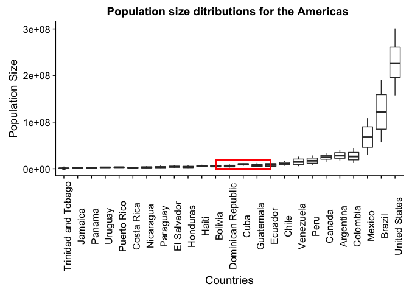

HW05\_THE\_FINISHER
================
Chad Fibke
2017-10-11

1.Installation of data set and data analysis packages
=====================================================

``` r
library(gapminder)
library(tidyverse)
```

    ## Loading tidyverse: ggplot2
    ## Loading tidyverse: tibble
    ## Loading tidyverse: tidyr
    ## Loading tidyverse: readr
    ## Loading tidyverse: purrr
    ## Loading tidyverse: dplyr

    ## Conflicts with tidy packages ----------------------------------------------

    ## filter(): dplyr, stats
    ## lag():    dplyr, stats

``` r
library(forcats)
```

Just some quick notes:

-   Comments about my code will be within code chunks:

``` r
# Like this 
```

-   Comments about my workflow will be outside of the code chunks.
-   I will be working with the gapminder dataset!

2.Factor management
===================

Let's take a look at gapminder to see what variables are concidered factors:

``` r
str(gapminder)
```

    ## Classes 'tbl_df', 'tbl' and 'data.frame':    1704 obs. of  6 variables:
    ##  $ country  : Factor w/ 142 levels "Afghanistan",..: 1 1 1 1 1 1 1 1 1 1 ...
    ##  $ continent: Factor w/ 5 levels "Africa","Americas",..: 3 3 3 3 3 3 3 3 3 3 ...
    ##  $ year     : int  1952 1957 1962 1967 1972 1977 1982 1987 1992 1997 ...
    ##  $ lifeExp  : num  28.8 30.3 32 34 36.1 ...
    ##  $ pop      : int  8425333 9240934 10267083 11537966 13079460 14880372 12881816 13867957 16317921 22227415 ...
    ##  $ gdpPercap: num  779 821 853 836 740 ...

Now we know gapminder's variable:

-   Country is a factor and has 142 different levels.

``` r
levels(gapminder$country) %>% 
  head() %>% 
  knitr::kable(col.names = "Country Factors")# I'm only showing few levels to help our poor eyes
```

| Country Factors |
|:----------------|
| Afghanistan     |
| Albania         |
| Algeria         |
| Angola          |
| Argentina       |
| Australia       |

-   Continent is a factor and has 5 different levels.

``` r
levels(gapminder$continent) %>% 
  knitr::kable( col.names = "Continent Factors")
```

| Continent Factors |
|:------------------|
| Africa            |
| Americas          |
| Asia              |
| Europe            |
| Oceania           |

We now know what factors we are working with, so see what we have to drop! We want to drop Ocieania, but lets see what we are actually dropping:

``` r
 EX.Ocieania <- gapminder %>% 
  filter(continent == "Oceania") 
 

EX.Ocieania$country %>%   
   fct_drop() %>% 
  levels() 
```

    ## [1] "Australia"   "New Zealand"

``` r
EX.Ocieania$continent %>%   
   fct_drop() %>% 
  nlevels() 
```

    ## [1] 1

The above shows that when we drop the Ocieania Continent:

-   One level will be dropped for continents.
-   Two levels will be dropped for countries.

Now we know how many we are dropping lets go in the revese direction and drop them:

``` r
Without.Ocieania <- gapminder %>% 
  filter(continent != "Oceania")

Droped.Ocieania <- Without.Ocieania %>%   
   droplevels()# droplevels was used because it can be applied to a dataset, whereas fct_drop  is applied to a vector. 

Droped.Ocieania$country %>%
  nlevels()# As seen above we have ofically droped the "Australia" and "New Zealand" levels, leaving us with 140 country levels.
```

    ## [1] 140

``` r
Droped.Ocieania$continent %>%
  levels()# As seen above we have ofically droped the Ocieania level, leaving us with only 4 remaining continent levels.
```

    ## [1] "Africa"   "Americas" "Asia"     "Europe"

We now have the Droped.Ocieania dataset with factors that are of intrest.

Let use this dataset to reorder the country factor based on the higest population size for the Americas:

``` r
POP.Growth <- Droped.Ocieania %>%
  filter(continent == "Americas") %>% 
  select(continent, country, year, pop) %>%
  group_by(country) %>%
  mutate(maxPop = max(pop))# this is just cleaning up some data to calclate the mam population size per continent
 POP.Growth %>%  
 ggplot(aes(x = country, y = maxPop))+
  geom_point()+
     theme(axis.text.x = element_text(angle = 90))
```


This graph makes our eyes work way to hard. Lets try reordering the factors based on population size!

``` r
 POP.Growth %>%  
 ggplot(aes(x = fct_reorder(country, maxPop), y = maxPop))+
  geom_point()+
     theme(axis.text.x = element_text(angle = 90))+
  xlab("Countries")+
  ylab("Max Population Size")
```


